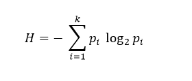

## Description
Python implementation of the CAIR project.

## Table of Contents
* [Links to literature](#links-to-literature)
* [CAIR algorithm](#The-CAIR-algorithm)  
* [Usage](#Usage)  
* [Toy data](#Toy-data)

## Links to literature 

* **runCAIR** (Calculating the CAIR of all proteomes)  
_Prepared manuscript._  
Python codes: [https://github.com/synaptic-neurolab/runCAIR_py](https://github.com/synaptic-neurolab/runCAIR_py).  

## The CAIR algorithm
CAIRs of each given protein is calculated using the following function of the shanon entropy:

  

## Usage

#### Run CAIR algorithm from Python
Fire up your python shell or ipython notebook. 

Required files to run runCAIR.py are available at:

* [uniprot_sprot.fasta](ftp://ftp.uniprot.org/pub/databases/uniprot/current_release/knowledgebase/complete/uniprot_sprot.fasta.gz)

* [uniprot_trembl.fasta](fhttps://www.uniprot.org/proteomes/?query=redundant:no&format=tab&force=true&columns=id,name,organism-id,lineage&compress=yes)

* [proteomes-redundant-no.tab](https://www.uniprot.org/proteomes/?query=redundant:no&format=tab&force=true&columns=id,name,organism-id,lineage&compress=yes)

## Toy data
The example data files to run all the functions are available here. Of note, these are just a small subsets of species dataset. We provided these "toy" data so that the user can test the method. 

However, if you plan to run the complete algorithm, you should download all the required files (~100GB).
